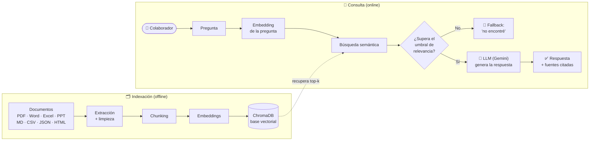

# 🤖 TechRetAI — Asistente RAG Corporativo

[](https://github.com/LeandroMelchiori/techretai_asistente_rag_corporativo/actions/workflows/ci.yml)
[](https://github.com/LeandroMelchiori/techretai_asistente_rag_corporativo/actions/workflows/deploy.yml)

> **TechRetAI** es un proyecto demostrativo que simula el asistente conversacional
> interno de TechRetail Solutions S.R.L. Responde preguntas de los colaboradores
> basándose en documentación corporativa ficticia y muestra las fuentes utilizadas.

**TechRetail Solutions S.R.L.** representa una plataforma SaaS de e-commerce para
PyMEs y emprendedores en Argentina. El asistente ingiere documentación interna en
**8 formatos distintos**, la indexa en una base vectorial y responde mediante
**RAG** (*Retrieval-Augmented Generation*), incorporando mecanismos para reducir
respuestas no fundamentadas y rechazar consultas cuando no encuentra contexto
suficientemente relevante.

---

## 🌐 En producción

**TechRetAI está desplegado y accesible en vivo:** **[https://techretai.sachadev.me](https://techretai.sachadev.me)**


> Desplegado en una VM de **Oracle Cloud Infrastructure** (Always Free), servido
> por Streamlit detrás de **Caddy** (HTTPS con certificado de Let's Encrypt) y
> actualizado automáticamente vía **GitHub Actions** en cada push a `main`.

---

## ✨ Características

- **Multi-formato:** procesa PDF, Word (`.docx`), Excel (`.xlsx`), PowerPoint
  (`.pptx`), Markdown, CSV, JSON y HTML.
- **Multi-dominio:** documentos organizados por área (RH, Financiero, Legal,
  Operacional, Comercial, Estratégico, Datos y Sistemas).
- **RAG completo:** extracción → limpieza → *chunking* → *embeddings* → base
  vectorial → recuperación semántica → generación con citación de fuentes.
- **Control de respuestas no fundamentadas:** si ningún fragmento supera el
  umbral de relevancia, el agente informa que no encontró la respuesta en vez de
  solicitar una generación sin contexto suficiente.
- **Citación de fuentes:** cada respuesta indica los documentos utilizados.
- **Proveedor intercambiable:** Google Gemini (por defecto) u OpenAI, cambiando
  una sola variable de entorno.
- **Interfaz de chat:** múltiples conversaciones con historial de sesión, creación,
  renombrado y eliminación, preguntas de ejemplo, fuentes y feedback.
- **Registro de ejecución:** consultas, relevancia, fuentes, latencia y feedback en
  formato JSON Lines para auditoría y análisis.
- **Desplegado en OCI:** ejecución como servicio `systemd` en una VM.
- **CI/CD:** despliegue automático mediante GitHub Actions con cada push a `main`.

---

## 🏗️ Arquitectura



Cada componente del pipeline vive en un módulo con una única responsabilidad:

| Fase del pipeline | Dónde está en el código |
|---|---|
| Colecta y organización | `documentos/` + `scripts/generar_documentos.py` |
| Proceso y extracción | `src/ingestion/loaders.py`, `src/ingestion/chunking.py` |
| Indexación | `src/vectorstore.py`, `scripts/ingest.py` |
| Recuperación RAG | `src/vectorstore.py::query`, `src/agent.py` |
| Generación y fallback | `src/agent.py` |
| Proveedores de IA | `src/providers.py` |
| Interfaz | `app/streamlit_app.py` |
| Despliegue en OCI | `docs/deploy_oci.md`, `deploy/techretai.service`, `Dockerfile` |
| CI/CD | `.github/workflows/deploy.yml` |
| Tests y evaluación | `tests/`, `eval/evaluar.py` |
| Registro de ejecución | `src/logging_utils.py`, `logs/consultas.jsonl` |

---

## 🚀 Puesta en marcha local

### 1. Requisitos

- Python 3.11+
- Una API key de [Google AI Studio](https://aistudio.google.com/app/apikey)
  **o** de [OpenAI](https://platform.openai.com/api-keys).

### 2. Instalación

```bash
git clone https://github.com/LeandroMelchiori/techretai_asistente_rag_corporativo.git
cd techretai_asistente_rag_corporativo

python -m venv .venv
source .venv/bin/activate       # Linux/macOS
# .venv\Scripts\activate      # Windows

pip install -r requirements.txt
cp .env.example .env
```

Completá en `.env` la API key del proveedor elegido.

### 3. Generar los documentos e indexarlos

```bash
python -m scripts.generar_documentos
python -m scripts.ingest --reset
```

### 4. Usar el agente

```bash
# Interfaz de chat
streamlit run app/streamlit_app.py

# Consulta desde terminal
python -m scripts.preguntar "¿Cuántos días de vacaciones me corresponden?"
```

---

## 💬 Preguntas de ejemplo

- *¿Cuántos días de vacaciones me corresponden con 6 años de antigüedad?* (RH)
- *¿Qué comisión cobra MercadoPago por tarjeta de crédito?* (Financiero)
- *¿Cuánto cuesta el plan Growth?* (Comercial)
- *¿Cómo funciona la facturación automática contra ARCA?* (Operacional)
- *¿Qué datos personales recolecta la empresa?* (Legal)
- *¿Qué endpoints tiene la API de TechRetail?* (Datos y Sistemas)

---

## 🔬 Tests y evaluación

**Tests automatizados** (unitarios, sin dependencias externas) que corren en CI
en cada push — cubren limpieza y *chunking*, extractores de formato y la lógica
del agente (fallback anti-alucinación y deduplicación de fuentes):

```bash
pip install -r requirements-dev.txt
pytest
```

**Evaluación del RAG:** un set de casos (`eval/preguntas_eval.json`) con la
fuente esperada de cada pregunta, más preguntas *fuera de alcance* que el agente
debe rechazar. Mide la calidad, no solo que "funcione":

```bash
python -m eval.evaluar
```

| Métrica | Qué mide |
|---|---|
| **Hit@k** | ¿El documento correcto aparece entre los `k` recuperados? |
| **MRR** | ¿Qué tan arriba aparece el documento correcto? |
| **Rechazo correcto** | ¿Rechaza las preguntas que no están en la base? |

---

## 🧠 Decisiones técnicas

- **RAG en lugar de *fine-tuning*:** los documentos internos cambian seguido. RAG
  permite actualizar la base sin reentrenar y, sobre todo, da **trazabilidad**
  (cada respuesta cita su fuente). Un modelo afinado sería más caro y opaco.
- **Umbral de relevancia + fallback:** se prioriza **no alucinar** sobre responder
  siempre. En dominios sensibles (Legal, RH, Finanzas) es preferible un "no
  encontré esta información" antes que una respuesta inventada.
- **ChromaDB como base vectorial:** embebida, sin infraestructura extra. La capa
  está aislada en `src/vectorstore.py`, así que migrar a *pgvector* u *Oracle
  23ai* si escalara es un cambio acotado.
- **Gemini con capa de proveedor intercambiable:** tier gratuito con embeddings;
  cambiar a OpenAI es una sola variable de entorno (`src/providers.py`).
- **Chunking por párrafos con superposición:** preserva el contexto sin cortar
  ideas; el conteo de tokens usa *tiktoken* con *fallback* local para no depender
  de la red al indexar.
- **VM + `systemd` en vez de Kubernetes:** el volumen no justifica orquestación;
  simple, Always Free y sobrevive reinicios. El `Dockerfile` queda para portabilidad.

---

## ⚙️ Configuración

Todas las opciones se controlan por variables de entorno definidas en
`.env.example`.

| Variable | Por defecto | Descripción |
|---|---:|---|
| `LLM_PROVIDER` | `gemini` | Proveedor: `gemini` u `openai` |
| `TOP_K` | `5` | Fragmentos recuperados por consulta |
| `MIN_RELEVANCE` | `0.25` | Umbral mínimo de relevancia |
| `CHUNK_SIZE` | `800` | Tamaño de cada fragmento |

---

## 📁 Estructura del proyecto

```text
techretai_asistente_rag_corporativo/
├── documentos/                # Base ficticia: 8 formatos y 7 categorías
├── src/
│   ├── config.py              # Configuración central
│   ├── providers.py           # Gemini/OpenAI: LLM y embeddings
│   ├── ingestion/             # Extracción, limpieza y chunking
│   ├── vectorstore.py         # Base vectorial ChromaDB
│   ├── agent.py               # Orquestación RAG, fuentes y fallback
│   └── logging_utils.py       # Registro de ejecución
├── scripts/
│   ├── generar_documentos.py  # Documentación corporativa ficticia
│   ├── ingest.py              # Indexación
│   └── preguntar.py           # Cliente CLI
├── app/streamlit_app.py       # Interfaz de chat
├── tests/                     # Tests automatizados (pytest)
├── eval/                      # Set y script de evaluación del RAG
├── deploy/techretai.service   # Servicio systemd
├── .github/workflows/         # CI (tests) + CD (deploy a OCI)
├── docs/deploy_oci.md         # Guía de despliegue
├── Dockerfile
├── requirements.txt
└── .env.example
```

---

## ☁️ Despliegue en OCI

El agente está desplegado en **Oracle Cloud Infrastructure**, sobre una VM
Compute (Always Free), donde corre como servicio `systemd`. El pipeline de
**GitHub Actions** actualiza automáticamente la aplicación con cada push a
`main`.

La guía completa está disponible en [`docs/deploy_oci.md`](docs/deploy_oci.md).

También puede ejecutarse con Docker:

```bash
docker build -t techretai-agente .
docker run -p 8501:8501 --env-file .env techretai-agente
```

---

## 🧪 Datos y alcance

Todos los documentos incluidos en `documentos/` son **datos ficticios**, creados
exclusivamente para demostrar el funcionamiento del asistente. No representan
información real de una empresa ni contienen datos personales reales.

TechRetAI es actualmente una demostración funcional. No debe utilizarse para
procesar documentación corporativa sensible sin implementar previamente los
controles de acceso, privacidad, seguridad y evaluación detallados en la hoja de
ruta.

---

# 🗺️ Hoja de ruta

La evolución del proyecto se resume en diez mejoras prioritarias:

1. [x] **Evaluación del RAG:** conjunto de preguntas de referencia con métricas de recuperación (Hit@k, MRR) y rechazo correcto. _Pendiente: groundedness, latencia y costo._
2. [x] **Pruebas y calidad de código:** pruebas unitarias con mocks de proveedores y CI en cada push. _Pendiente: cobertura, linting, formateo y tipos._
3. [ ] **Seguridad frente a prompt injection:** tratar documentos como datos no confiables, reforzar el prompt y probar ataques directos e indirectos.
4. [ ] **Autenticación y permisos:** agregar usuarios, roles, sesiones, rate limiting y autorización por área durante la recuperación.
5. [ ] **Privacidad y logs:** anonimizar datos sensibles, permitir desactivar el registro de contenido y definir rotación y retención de logs.
6. [ ] **Resiliencia y manejo de errores:** ocultar errores técnicos, agregar timeouts, reintentos, health checks y fallback entre proveedores.
7. [ ] **Citaciones verificables:** guardar página, hoja, diapositiva o sección y permitir revisar el fragmento exacto utilizado.
8. [ ] **Mejora de recuperación:** evaluar chunking, búsqueda híbrida, reranking, eliminación de duplicados y reindexación incremental.
9. [ ] **Observabilidad:** crear métricas de calidad, uso, latencia, errores, feedback y costo por proveedor y versión del sistema.
10. [ ] **Evolución del producto:** persistir conversaciones, mejorar accesibilidad, administrar documentos desde una interfaz segura y separar el núcleo RAG de la interfaz para facilitar su escalabilidad.

---

## 📝 Licencia y autoría

Proyecto académico y demostrativo desarrollado por **Leandro Melchiori**.

El nombre TechRetail Solutions S.R.L. y toda la documentación corporativa del
repositorio se utilizan como escenario ficticio para demostrar la arquitectura y
el funcionamiento del asistente.
