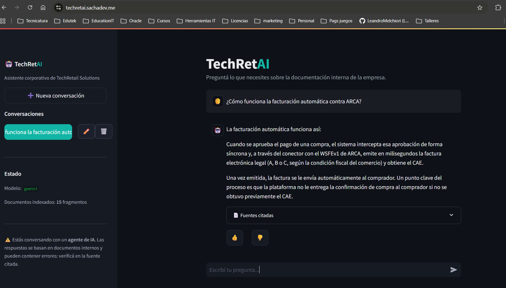

# 🤖 TechRetAI — Asistente RAG Corporativo

[](https://github.com/LeandroMelchiori/techretai_asistente_rag_corporativo/actions/workflows/deploy.yml)

> **TechRetAI** es el asistente conversacional interno de TechRetail Solutions
> S.R.L.: responde preguntas de los colaboradores basándose en la documentación
> de la empresa, citando siempre la fuente.

**TechRetail Solutions S.R.L.** es una plataforma SaaS de e-commerce para PyMEs
y emprendedores en Argentina. Este asistente ingiere la documentación interna en
**8 formatos distintos**, la indexa en una base vectorial y responde preguntas
mediante **RAG** (*Retrieval-Augmented Generation*), sin inventar información.

---

## 🌐 En producción

**TechRetAI está desplegado y accesible en vivo:** **[https://techretai.sachadev.me](https://techretai.sachadev.me)**



> Desplegado en una VM de **Oracle Cloud Infrastructure** (Always Free), servido
> por Streamlit detrás de **Caddy** (HTTPS con certificado de Let's Encrypt) y
> actualizado automáticamente vía **GitHub Actions** en cada push a `main`.

---

## ✨ Características

- **Multi-formato:** procesa PDF, Word (`.docx`), Excel (`.xlsx`), PowerPoint
  (`.pptx`), Markdown, CSV, JSON y HTML.
- **Multi-dominio:** documentos organizados por área (RH, Financiero, Legal,
  Operacional, Comercial, Estratégico, Datos y Sistemas).
- **RAG completo:** extracción → limpieza → *chunking* → *embeddings* → base
  vectorial → recuperación semántica → generación con citación de fuentes.
- **Anti-alucinación:** si ningún fragmento supera el umbral de relevancia, el
  agente responde *"no encontré esta información"* en lugar de inventar.
- **Citación de fuentes:** cada respuesta indica de qué documento salió.
- **Proveedor intercambiable:** Google Gemini (por defecto) u OpenAI, cambiando
  una sola variable de entorno.
- **Interfaz de chat** estilo asistente de IA: múltiples conversaciones con
  historial (crear, renombrar, eliminar), preguntas de ejemplo, fuentes citadas
  y botones de feedback.
- **Registro de ejecución** en formato JSON Lines para auditoría.
- **Desplegado en OCI:** corre en una VM de Oracle Cloud como servicio `systemd`.
- **CI/CD:** cada push a `main` se despliega solo en la VM vía GitHub Actions.

---

## 🏗️ Arquitectura

```
documentos/                 scripts/ingest.py            src/agent.py
┌───────────────┐          ┌──────────────────┐        ┌───────────────────┐
│ PDF Word XLSX │          │ 1. Extracción    │        │ 4. Recuperación   │
│ PPTX MD CSV   │  ──────► │ 2. Limpieza      │ ─────► │ 5. Generación +   │
│ JSON HTML     │          │ 3. Chunking +    │  Chroma│    citación de    │
│ (7 categorías)│          │    embeddings    │  (DB   │    fuentes        │
└───────────────┘          └──────────────────┘  vect.)└───────────────────┘
                                                              │
                                                     app/streamlit_app.py
                                                       (interfaz de chat)
```

Cada componente del pipeline vive en un módulo con una única responsabilidad:

| Fase del pipeline | Dónde está en el código |
|---|---|
| Colecta y organización | `documentos/` (por categoría) + `scripts/generar_documentos.py` |
| Proceso y extracción | `src/ingestion/loaders.py`, `src/ingestion/chunking.py` |
| Indexación | `src/vectorstore.py`, `scripts/ingest.py` |
| Recuperación (RAG) | `src/vectorstore.py::query`, `src/agent.py` |
| Producción y validación | `src/agent.py` (prompt, umbral, fallback) |
| Interfaz | `app/streamlit_app.py` |
| Despliegue en OCI | `docs/deploy_oci.md`, `deploy/techretai.service`, `Dockerfile` |
| CI/CD (auto-deploy) | `.github/workflows/deploy.yml` |
| Registro de ejecución | `src/logging_utils.py`, `logs/consultas.jsonl` |

---

## 🚀 Puesta en marcha (local)

### 1. Requisitos

- Python 3.11+
- Una API key de [Google AI Studio](https://aistudio.google.com/app/apikey)
  **o** de [OpenAI](https://platform.openai.com/api-keys).

### 2. Instalación

```bash
git clone <url-del-repositorio>
cd techretai_asistente_rag_corporativo

python -m venv .venv && source .venv/bin/activate   # en Windows: .venv\Scripts\activate
pip install -r requirements.txt

cp .env.example .env        # completá tu API key en el archivo .env
```

### 3. Generar los documentos e indexarlos

```bash
python -m scripts.generar_documentos   # crea la base de conocimiento de ejemplo
python -m scripts.ingest --reset       # extrae, fragmenta e indexa todo
```

### 4. Usar el agente

```bash
# Interfaz de chat (recomendada)
streamlit run app/streamlit_app.py

# O desde la terminal
python -m scripts.preguntar "¿Cuántos días de vacaciones me corresponden?"
```

---

## 💬 Preguntas de ejemplo

- *¿Cuántos días de vacaciones me corresponden con 6 años de antigüedad?* (RH)
- *¿Qué comisión cobra MercadoPago por tarjeta de crédito?* (Financiero)
- *¿Cuánto cuesta el plan Growth?* (Comercial)
- *¿Cómo funciona la facturación automática contra ARCA?* (Operacional)
- *¿Qué datos personales recolecta la empresa?* (Legal)
- *¿Qué endpoints tiene la API de TechRetail?* (Datos y Sistemas)

---

## ⚙️ Configuración

Todas las opciones se controlan por variables de entorno (ver `.env.example`).
Las más importantes:

| Variable | Por defecto | Descripción |
|---|---|---|
| `LLM_PROVIDER` | `gemini` | Proveedor: `gemini` u `openai` |
| `TOP_K` | `5` | Fragmentos recuperados por consulta |
| `MIN_RELEVANCE` | `0.25` | Umbral de relevancia para responder |
| `CHUNK_SIZE` | `800` | Tamaño de cada fragmento |

---

## 📁 Estructura del proyecto

```
techretai_asistente_rag_corporativo/
├── documentos/              # Base de conocimiento (8 formatos, 7 categorías)
├── src/
│   ├── config.py            # Configuración central
│   ├── providers.py         # Capa LLM/embeddings (Gemini/OpenAI)
│   ├── ingestion/           # Extracción, limpieza y chunking
│   ├── vectorstore.py       # Base vectorial (ChromaDB)
│   ├── agent.py             # Orquestación RAG + citación
│   └── logging_utils.py     # Registro de ejecución
├── scripts/
│   ├── generar_documentos.py  # Crea los documentos de ejemplo
│   ├── ingest.py              # Indexa los documentos
│   └── preguntar.py           # CLI de consulta
├── app/streamlit_app.py     # Interfaz de chat
├── docs/deploy_oci.md       # Guía de despliegue en OCI
├── Dockerfile
├── requirements.txt
└── .env.example
```

---

## ☁️ Despliegue en OCI

El agente está desplegado en **Oracle Cloud Infrastructure**, sobre una VM
Compute (Always Free) donde corre como **servicio `systemd`**
(`deploy/techretai.service`). El pipeline de **GitHub Actions**
(`.github/workflows/deploy.yml`) actualiza la VM automáticamente en cada push a
`main`. La guía completa está en **[`docs/deploy_oci.md`](docs/deploy_oci.md)**.

También puede ejecutarse con Docker:

```bash
docker build -t techretail-agente .
docker run -p 8501:8501 --env-file .env techretail-agente
```

---

## 🧪 Sobre los datos

Todos los documentos de `documentos/` son **datos de ejemplo** (ficticios),
generados para poblar la base de conocimiento del asistente. No representan
datos reales de ninguna empresa ni persona.

---

## 📝 Licencia

© 2026 TechRetail Solutions S.R.L. Todos los derechos reservados.
